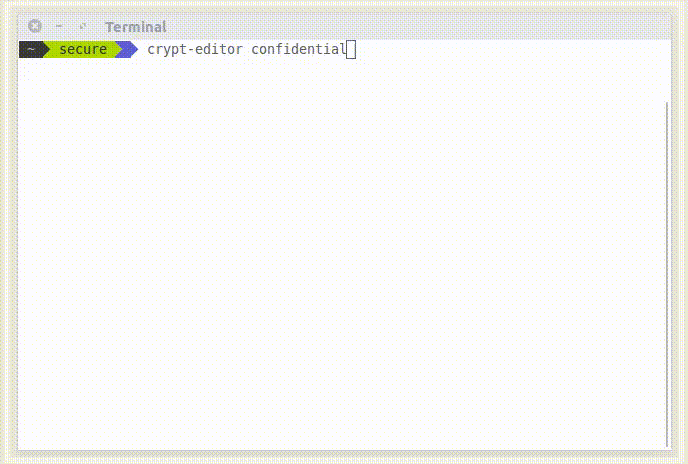

Crypt Editor
============
Easily create, save, edit gpg/mcrypt encrypted files using any of your favourite editors. Crypt Editor acts like a binder around the editor you use to manage the password encrypted files that decrypts the file before editing and encrypting it back later. 



Installation
============
Setting up crypt-editor is simple and straight forward.

```
git clone https://github.com/alseambusher/crypt-editor
cp crypt-editor/crypt-editor /usr/bin
```

If you want to use mcrypt instead of gpg, you have to install mcrypt.

```
apt-get install mcrypt
```

Usage
=====
```
crypt-editor -help
crypt-editor [filename]
crypt-editor [editor] [filename]
crypt-editor [-k key] [filename]
crypt-editor [-k key] [editor] [filename]

To create new file with mcrypt instead of gpg use -m option
crypt-editor -m [filename]

```

Examples:
```
crypt-editor passwords
crypt-editor gedit passwords
crypt-editor -k pa$$word passwords
crypt-editor -k pa$$word gvim passwords
```
